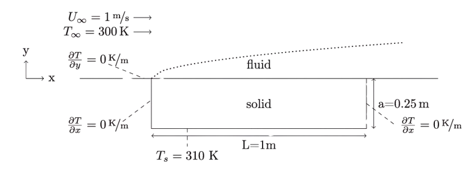
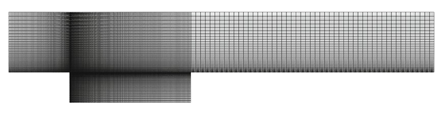

{}

The following section provides a collection of curated examples that demonstrate
how to use multiRegionFoam for solving various types of multi-region,
multiphysics problems. Each case is structured to highlight different aspects of
the solver, such as thermal coupling, fluid-fluid interface tracking, or
electrochemical transport. These examples are also designed to help new users
understand how to set up, configure, and analyze different physical models with
the framework.

<!-- ```math
\tag*{(1)} P(E) = {n \choose k} p^k (1-p)^{n-k}
``` -->

<!-- A sample site using the Docsy Hugo theme. {.mt-5} -->

{}

<!-- {}

{} -->
<!-- ==================================================== Section 1 =========================================================================== -->

{}

# 1. Forced convection heat transfer from a flat plate

{.text-justify}

The fluid enters the computational domain at uniform temperature and velocity,
flowing tangentially over a solid plate that is maintained at a constant
temperature on its underside. The upper surface of the plate is thermally
coupled to the fluid. The configuration is arranged to capture strong thermal
gradients near the leading edge and within the developing boundary layer.

<figure style="text-align: center;">
  
  <figcaption><strong>Figure: 1.1</strong> Computational domain and boundary conditions for the flow over a heated plate</figcaption>
</figure>

The mesh consists of structured hexahedral elements with progressive refinement
toward the fluid-solid interface and leading edge of the plate. This ensures
accurate resolution of both the thermal and viscous boundary layers without
numerical instability or diffusion errors.

<figure style="text-align: center;">
  
  <figcaption><strong>Figure: 1.2</strong> Meshes for the flow over a heated plate simulation</figcaption>
</figure>

The energy equation in both regions is formulated consistently using the general
unsteady thermal transport model. In the fluid domain, the governing equation
for temperature \( T \) is defined as:

```math
\rho c_p \left( \frac{\partial T}{\partial t} + \mathbf{u} \cdot \nabla T \right) = \nabla \cdot \left( k \nabla T \right)
```

In the solid domain, where the velocity field is absent, the model simplifies
to:

```math
\rho c_p \frac{\partial T}{\partial t} = \nabla \cdot \left( k \nabla T \right)
```

Where:

- \( \rho \) is density in kg/m³
- \( c_p \) is specific heat capacity in J/kg·K
- \( k \) is thermal conductivity in W/m·K
- \( \mathbf{u} \) is velocity in m/s

The interface between the fluid and solid regions is modeled using the
`heatTransferInterface` interface type. Two coupling strategies are configured:
a monolithic approach using the `monolithicTemperature` boundary on both sides,
and a partitioned method combining a Dirichlet condition on the fluid and a
Neumann condition on the solid.

<div style="display: flex; justify-content: center; width: 100%;">
  <figure style="text-align: center; margin: 2rem auto;">
    <table style="border-collapse: collapse; width: auto;">
      <thead>
        <tr>
          <th style="border-bottom: 2px solid black; padding: 8px;">Region</th>
          <th style="border-bottom: 2px solid black; padding: 8px;">Boundary</th>
          <th style="border-bottom: 2px solid black; padding: 8px;">Partitioned</th>
          <th style="border-bottom: 2px solid black; padding: 8px;">Monolithic</th>
        </tr>
      </thead>
      <tbody>
        <tr>
          <td style="text-align: center; border-bottom: 1px solid black; padding: 8px;">Fluid</td>
          <td style="text-align: center; border-bottom: 1px solid black; padding: 8px;">bottom</td>
          <td style="text-align: center; border-bottom: 1px solid black; padding: 8px;">regionCoupledTemperatureJump</td>
          <td style="text-align: center; border-bottom: 1px solid black; padding: 8px;">monolithicTemperature</td>
        </tr>
        <tr>
          <td style="text-align: center; padding: 8px;">Solid</td>
          <td style="text-align: center; padding: 8px;">top</td>
          <td style="text-align: center; padding: 8px;">regionCoupledHeatFlux</td>
          <td style="text-align: center; padding: 8px;">monolithicTemperature</td>
        </tr>
      </tbody>
    </table>
    </div>
    <div style="display: flex; justify-content: center; width: 100%; margin-top: -2rem; margin-bottom: 1rem;">
    <figcaption style="margin-top: 0.75rem; font-style: italic;">
      <strong>Table 3:</strong> Coupled thermal boundary conditions for the flow over a heated plate simulation
    </figcaption>
  </figure>
</div>

Boundary conditions are applied per region as follows. The inlet applies a fixed
velocity of $(1, 0, 0) \, \mathrm{m/s}$ and an inlet temperature
$T_\infty = 300\,\mathrm{K}$. At the outlet, all gradients are set to zero. The
bottom of the solid region is maintained at a constant temperature
$T_s = 310\,\mathrm{K}$, and lateral solid boundaries are adiabatic. The
fluid-solid interface is shared and coupled across the region boundary.

<!-- **Table 2**: _Boundary Conditions_ -->

<div style="display: flex; justify-content: center; width: 100%;">
  <figure style="text-align: center; margin: 2rem auto;">
    <table style="border-collapse: collapse; margin: 0 auto; background-color: transparent; font-family: serif;">
      <thead>
        <tr>
          <th style="border-bottom: 2px solid black; padding: 6px 12px;">Boundary</th>
          <th style="border-bottom: 2px solid black; padding: 6px 12px;">Thermal</th>
          <th style="border-bottom: 2px solid black; padding: 6px 12px;">Velocity</th>
        </tr>
      </thead>
      <tbody>
        <!-- Fluid Section -->
        <tr>
          <td colspan="3" style="text-align: left; font-weight: bold; padding-top: 12px;">Fluid</td>
        </tr>
        <tr>
          <td style="padding: 6px 12px;">inlet</td>
          <td style="padding: 6px 12px;">300&nbsp;K</td>
          <td style="padding: 6px 12px;">(1&nbsp;0&nbsp;0)<sup>T</sup> m/s</td>
        </tr>
        <tr>
          <td style="padding: 6px 12px;">bottom</td>
          <td style="padding: 6px 12px;">coupled</td>
          <td style="padding: 6px 12px;">(0&nbsp;0&nbsp;0)<sup>T</sup> m/s</td>
        </tr>
        <tr>
          <td style="padding: 6px 12px;">slip-bottom (before the plate)</td>
          <td style="padding: 6px 12px;">zeroGradient</td>
          <td style="padding: 6px 12px;">zeroGradient</td>
        </tr>
        <tr>
          <td style="padding: 6px 12px;">noSlip-bottom (after the plate)</td>
          <td style="padding: 6px 12px;">zeroGradient</td>
          <td style="padding: 6px 12px;">(0&nbsp;0&nbsp;0)<sup>T</sup> m/s</td>
        </tr>
        <tr>
          <td style="padding: 6px 12px;">Outlet, top</td>
          <td style="padding: 6px 12px;">zeroGradient</td>
          <td style="padding: 6px 12px;">zeroGradient</td>
        </tr>
        <!-- Solid Section -->
        <tr>
          <td colspan="3" style="text-align: left; font-weight: bold; padding-top: 12px;">Solid</td>
        </tr>
        <tr>
          <td style="padding: 6px 12px;">top</td>
          <td style="padding: 6px 12px;">coupled</td>
          <td style="padding: 6px 12px;">&mdash;</td>
        </tr>
        <tr>
          <td style="padding: 6px 12px;">bottom</td>
          <td style="padding: 6px 12px;">310&nbsp;K</td>
          <td style="padding: 6px 12px;">&mdash;</td>
        </tr>
        <tr>
          <td style="padding: 6px 12px;">left, right</td>
          <td style="padding: 6px 12px;">zeroGradient</td>
          <td style="padding: 6px 12px;">&mdash;</td>
        </tr>
      </tbody>
    </table>
    </div>
    <div style="display: flex; justify-content: center; width: 100%; margin-top: -2rem; margin-bottom: 1rem;">
    <figcaption style="margin-top: 0.75rem; font-style: italic;">
      <strong>Table 2:</strong> Boundary conditions for the flow over a heated plate
    </figcaption>
  </figure>
</div>

The thermophysical properties are kept nondimensional for clarity. The fluid
region is assigned unit density, unit specific heat, and unit thermal
conductivity. The solid region also has unit properties, except for the thermal
conductivity, which is varied to create contrast between the two regions using
values of $k_s/k_f = 1, 5, 20$.

<!-- **Table 5**: _Material Properties_ -->

<div style="display: flex; justify-content: center; width: 100%;">
  <figure style="text-align: center; margin: 2rem auto;">
    <table style="border-collapse: collapse; margin: 0 auto; background-color: transparent; font-family: serif;">
      <thead>
        <tr>
          <th style="border-bottom: 2px solid black; padding: 6px 12px;">Property</th>
          <th style="border-bottom: 2px solid black; padding: 6px 12px;">Symbol</th>
          <th style="border-bottom: 2px solid black; padding: 6px 12px;">Unit</th>
          <th style="border-bottom: 2px solid black; padding: 6px 12px;">Solid</th>
          <th style="border-bottom: 2px solid black; padding: 6px 12px;">Fluid</th>
        </tr>
      </thead>
      <tbody>
        <tr>
          <td style="padding: 6px 12px;">Density</td>
          <td style="padding: 6px 12px;">&rho;</td>
          <td style="padding: 6px 12px;">kg/m<sup>3</sup></td>
          <td style="padding: 6px 12px;">1</td>
          <td style="padding: 6px 12px;">1</td>
        </tr>
        <tr>
          <td style="padding: 6px 12px;">Dynamic viscosity</td>
          <td style="padding: 6px 12px;">&mu;</td>
          <td style="padding: 6px 12px;">kg/ms</td>
          <td style="padding: 6px 12px;">&mdash;</td>
          <td style="padding: 6px 12px;">&rho;<sub>f</sub>U<sub>&infin;</sub>L / Re</td>
        </tr>
        <tr>
          <td style="padding: 6px 12px;">Thermal conductivity</td>
          <td style="padding: 6px 12px;">k</td>
          <td style="padding: 6px 12px;">W/m &middot; K</td>
          <td style="padding: 6px 12px;">100</td>
          <td style="padding: 6px 12px;">k<sub>s</sub> / k</td>
        </tr>
        <tr>
          <td style="padding: 6px 12px;">Specific heat capacity</td>
          <td style="padding: 6px 12px;">c<sub>p</sub></td>
          <td style="padding: 6px 12px;">J/kg &middot; K</td>
          <td style="padding: 6px 12px;">100</td>
          <td style="padding: 6px 12px;">k<sub>f</sub>Pr / &mu;</td>
        </tr>
      </tbody>
    </table>
    </div>
    <div style="display: flex; justify-content: center; width: 100%; margin-top: -2rem; margin-bottom: 1rem;">
    <figcaption style="margin-top: 0.75rem; font-style: italic;">
      <strong>Table 5:</strong> Thermophysical properties of the fluid and solid for the flow over a heated plate
    </figcaption>
  </figure>
</div>

Test cases are parametrized over Reynolds numbers (Re), Prandtl numbers (Pr),
and conductivity ratios (k). The Reynolds numbers used are 500 and 10,000. The
Prandtl numbers include both highly diffusive $\text{Pr} = 0.01$ and
high-viscosity $\text{Pr} = 100$ cases. Six combinations of these values are
evaluated in total.

<!-- **Table 4**: _Simulation Parameters_ -->

<div style="display: flex; justify-content: center; width: 100%;">
  <figure style="text-align: center; margin: 2rem auto;">
    <table style="border-collapse: collapse; margin: 0 auto; background-color: rgba(255,255,255,0); font-family: serif;">
      <thead>
        <tr>
          <th style="border-bottom: 2px solid black; padding: 6px 12px;">Re</th>
          <th style="border-bottom: 2px solid black; padding: 6px 12px;">Pr</th>
          <th style="border-bottom: 2px solid black; padding: 6px 12px;">k</th>
        </tr>
      </thead>
      <tbody>
        <tr>
          <td style="padding: 6px 12px;">500</td>
          <td style="padding: 6px 12px;">0.01</td>
          <td style="padding: 6px 12px;">1, 5, 20</td>
        </tr>
        <tr>
          <td style="padding: 6px 12px;">0000</td>
          <td style="padding: 6px 12px;">0.01</td>
          <td style="padding: 6px 12px;">1, 5, 20</td>
        </tr>
        <tr>
          <td style="padding: 6px 12px;">500</td>
          <td style="padding: 6px 12px;">100</td>
          <td style="padding: 6px 12px;">1, 5, 20</td>
        </tr>
      </tbody>
    </table>
    </div>
    <div style="display: flex; justify-content: center; width: 100%; margin-top: -2rem; margin-bottom: 1rem;">
    <figcaption style="font-style: italic;">
      <strong>Table 4:</strong> Parameters for the flow over a heated plate simulation
    </figcaption>
  </figure>
    </div>

Temperature development across the interface is evaluated using a dimensionless
boundary temperature:

```math
\theta = \frac{T - T_\infty}{T_s - T_\infty}
```

<!-- **Figure 9a–c**: _Insert plot comparisons here for θ across all case
combinations_ -->

<!-- <figure style="text-align: center;">
  
  <figcaption style="margin-top: 0.5rem;">
    <strong>Figure 1:</strong> Dimensionless conjugate boundary temperature
    $\theta$ over non-dimensional distance $x$ for $\text{Pr} = 0.01$ and $\text{Re} = 500$
  </figcaption>
</figure> -->

Solver performance is also tracked. The average time spent per timestep for
coupling is compared between partitioned and monolithic schemes. The monolithic
approach proves to be more robust and efficient, particularly for high Prandtl
number flows.

<!-- **Figure 9d**: *Insert performance timing chart* -->

{.text-justify}

<!-- {.text-center} -->
<!-- Python code snipper -->

<figure style="text-align: center;">
  
# Specify baseCaseDir and caseStructure as in genCases.py (cf. Listing 15)
# Specify directories in the postProcessing folder to retrieve data from
TdataDir = ’sets/fluid’
Tdata = casefoam.positional_field (TdataDir, ’DataFile_T.xy’, 10,

caseStructure, baseCaseDir)

# Rename the columns

Tdata.columns = [’x’,’T’,’coupling method’,’parameters’]

# Calculate a new column (theta) from the temperature

Tdata[’theta’] = (Tdata[’T’]-300)/(310-300) 

  <figcaption><strong>Listing 1:</strong>  Snippet of getResults.py to retrieve the tests results using CaseFOAM</figcaption>
</figure>

<!-- Python code snippet -->

<figure style="text-align: center;">
  

# Specify the base case name and a directory name for the tests

baseCase = ’baseCase’ baseCaseDir = ’tests’

# Specify the names of the test

cases caseStructure = [# main cases [’monolithic’,’ partitioned_Aitken’],

# subcases for each of the main cases

[’Pr_0.01_Re_500_k_1’, ’Pr_0.01_Re_500_k_5’, ’Pr_0.01_Re_500_k_20’,
’Pr_0.01_Re_10000_k_1’, ’Pr_0.01_Re_10000_k_5’, ’Pr_0.01_Re_10000_k_20’,
’Pr_100_Re_500_k_1’, ’Pr_100_Re_500_k_5’, ’Pr_100_Re_500_k_20’]]

# Partitioned coupling with acceleration type and init. relaxation factor

def p_coupled(accType, relaxValue): return { ’0/fluid/orig/partitioned/T’:
{’boundaryField’: {’interface’: {’accType’: accType, ’relax’ : relaxValue}}},
#!bash’: ’cp baseCase/AllrunP tests/baseCase/Allrun’ }

# Monolithic coupling

m_coupled = {’#!bash’: ’cp baseCase/AllrunM tests/baseCase/Allrun’}

# Parameters

def update_params(Pr, Re, k): L = 1.0 rhof = 1.0 ks = 100.0 Uinf = 1.0 mu =
rhof*Uinf*L/int(Re) kf = ks/k cp = kf\*Pr/mu return { ’constant/fluid/transport
Properties’: { ’mu’: ’mu [ 1-1-1 0 0 0 0 ] %s’ %mu, ’cp’: ’cp [ 0 2-2-1 0 0 0 ]
%s’ %cp, ’k’: ’k [1 1-3-1 0 0 0] %s’ %kf}, ’0/fluid/orig/monolithic/k’:
{’internalField’: ’uniform %s’ %kf} }

# Define input parameters for each of the cases listed in "caseStructure"

caseData = { ’monolithic’ : m_coupled, ’partitioned_Aitken_0.75’:
p_coupled(’aitken’, ’0.75’), ’Pr_0.01_Re_500_k_1’: update_params(0.01, 500, 1),
’Pr_0.01_Re_500_k_5’:update_params(0.01, 500, 5), ’Pr_0.01_Re_500_k_20’:
update_params(0.01, 500, 20), ’Pr_0.01_Re_10000_k_1’: update_params(0.01, 10000,
1), ’Pr_0.01_Re_10000_k_5’: update_params(0.01, 10000, 5),
’Pr_0.01_Re_10000_k_20’: update_params(0.01, 10000, 20), ’Pr_100_Re_500_k_1’:
update_params(100, 500, 1), ’Pr_100_Re_500_k_5’: update_params(100, 500, 5),
’Pr_100_Re_500_k_20’: update_params(100, 500, 20) }

casefoam.mkCases(baseCase, caseStructure, caseData, hierarchy=’tree’,
writeDir=baseCaseDir) 

  <figcaption><strong>Snippet 2:</strong> genCases.py script to generate the parameter study with CaseFOAM.</figcaption>
</figure>

{}

<!-- ===================================================== Section 1 - End ==================================================================== -->

<!-- ===================================================== Section 2 - ======================================================================== -->

<!-- ===================================================== Section 2 - End ==================================================================== -->
